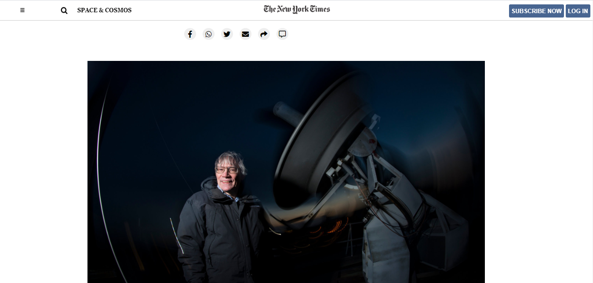

# Microverse - Week 1 Positioning and Floating

A project that is based on using various css positioning techniques (float, flex and grid).

# Uses With
- HTML and CSS
- Flex Box
- CSS Grid
- Floating Elements

#Live Demo
- https://emmyn5600.github.io/NewYorkTime_Clone/

# Authors

👤 NSABIMANA Emmanuel
- GitHub: [@emmyn5600](https://github.com/Emmyn5600)
- Twitter: [@NSABIMA62253884](https://twitter.com/NSABIMA62253884)
- LinkedIn: [@nsabimana-emmanuel-4276091b2](https://www.linkedin.com/in/nsabimana-emmanuel-4276091b2/)

# 🤝 Contributing

Contributions, issues, and feature requests are welcome! Feel free to check the issues page.

# Show your support 

Give a ⭐️ if you like this project!

# Acknowledgments

- Microverse
- Hat tip to anyone whose code was used
- Inspiration

# 📝 License 

This project is MIT licensed.
